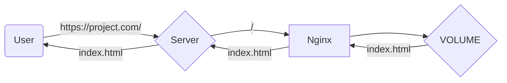
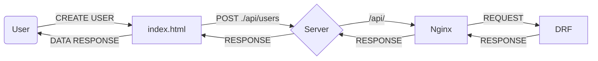
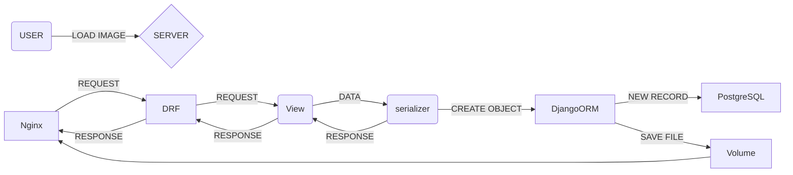

# Foodgram project

## Описание проекта

Привет! Это мой дипломный проект Foodgram в который я вложил полученные в **Яндекс.Практикуме** знания о **backend-разработке**.
Данный проект представляет из себя сервис, где пользователи могут оставить свои лучшие рецепты, подписываться на других пользователей, добавлять рецепты в избранное или в корзину из которой можно **скачать список ингредиентов**.

[Ссылка на проект](http://ereshkoproject.ddns.net/recipes)

## Технологии
### Сервер
 - Ubuntu
 - Nginx
 - Docker
### Backend
 - Python 3.11
 - Django 4.1.3
 - Django rest-framework 3.14.0
 - PostgreSQL
 - Gunicorn
### Frontend
 - Node 13.12.0
 - React


## Техническое описание проекта
### Hello world
При переходе на страницу [проекта](http://ereshkoproject.ddns.net/recipes) пользователь получает от сервера index.html 


### Взаимодействие с backend
Все процессы связанные с представлением данных, их записью, редакцией и удалением (CRUD) происходят на стороне backend. Для удобства пользователя все запросы к серверу осуществляются через пользовательский интерфейс сгенерированный fontend'ом. При взаимодействии пользователя frontend отправляет запросы к api backend'а и отображает полученный результат.


Например: пользователь отправил POST-запрос на создание пользователя. Запрос приходит на сервер, там его обрабатывает Nginx и перенаправляет в контейнер с DRF, затем DRF отправляет обратно по цепочке.
### Работа backend
DRF обрабатывает входящие запросы, сериализует данные, обрабатывает и отправляет обратно, при надобности сериализует обратно.

Пример загрузки изображения.

### Примеры взаимодействия с API
Ниже будут представлены простые примеры взаимодействия с API. Более подробная документация доступна в формате [Redoc](http://ereshkoproject.ddns.net/api/docs/redoc.html)

#### Регистрация пользователя
**POST**-Request --> `/api/user/`
```json
{
	"email": "email@mail.com",
	"username": "user_name",
	"first_name": "Vasya",
	"last_name": "Pupkin",
	"password": "8800qwerty"
}
```
Response **201**
```JSON
{
	"email": "email@mail.com",
	"id": "69",
	"username": "user_name",
	"first_name": "Vasya",
	"last_name": "Pupkin",
}
```
#### Получение тоекна аутентификации
**POST**-Request --> `/api/auth/token/login/`
```JSON
{
	"email": "email@mail.com",
	"password": "8800qwerty"
}
```
Response **201**
```json
{
	"auth_token": "f66f592c0a0b4fe9492c0a0b0e809b892c0a0b5"
}
```

#### Создание рецепта
**POST**-Request --> `/api/recipes/`
```JSON
{
	"ingredients": [
		{
			"id": 2188,
			"amount": 10
		},
		{
			"id": 1337,
			"amount": 30
		}
	],
	"tags": [
		1,
		2
	],
	"image": "data:image/png;base64,iVBORw0KGgoAAAANSUhEUgAAAAEAAAABAgMAAABieywaAAAACVBMVEUAAAD///9fX1/S0ecCAAAACXBIWXMAAA7EAAAOxAGVKw4bAAAACklEQVQImWNoAAAAggCByxOyYQAAAABJRU5ErkJggg==",
	"name": "string",
	"text": "string",
	"cooking_time": 1
}
```
Response **201**
```JSON
{
	"tags": [
		{
			"id": 1,
			"name": "Завтрак",
			"color": "#fcba03",
			"slug": "breakfast"
		},
		{
			"id": 2,
			"name": "Обед",
			"color": "#bafc03",
			"slug": "lunch"
		}
	],
	"author": {
		"email": "user1@admin.ru",
		"id": 1,
		"username": "user",
		"first_name": "Vasya",
		"last_name": "Pupkin",
		"is_subscribed": false
	},
	"ingredients": [
		{
			"id": 2188,
			"name": "ячневая крупа",
			"measurement_unit": "г",
			"amount": 10
		},
		{
			"id": 1337,
			"name": "полба",
			"measurement_unit": "г",
			"amount": 30
		}
	],
	"is_favorited": false,
	"is_in_shopping_cart": false,
	"name": "string",
	"image": "http://localhost:8000/media/recipes/image.png",
	"text": "string",
	"cooking_time": 1
}
```
## Панель администратора
Панель администратора доступна по [ссылке](ereshkoproject.ddns.net/admin)

> Для ревью: admin:admin

## Автор
Ерешко Данил 
[Telegram](https://t.me/ereshkodanil)


### Благодарю Максима Колодникова и команду Яндекс.Практикума за помощь в обучении <3